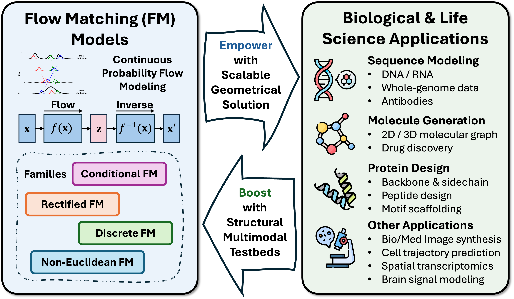
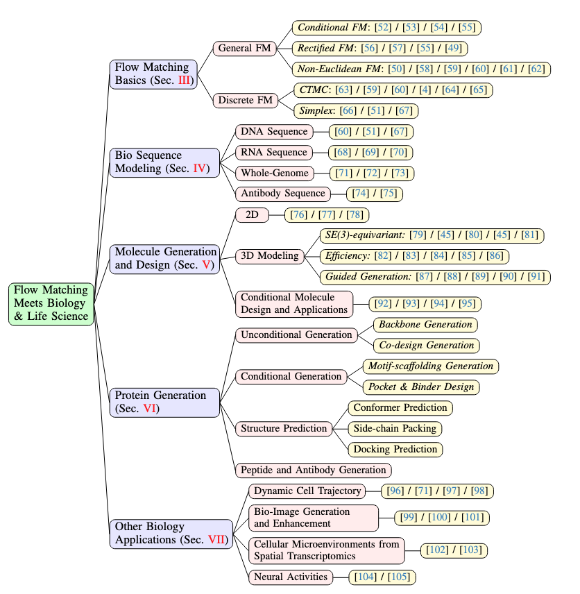
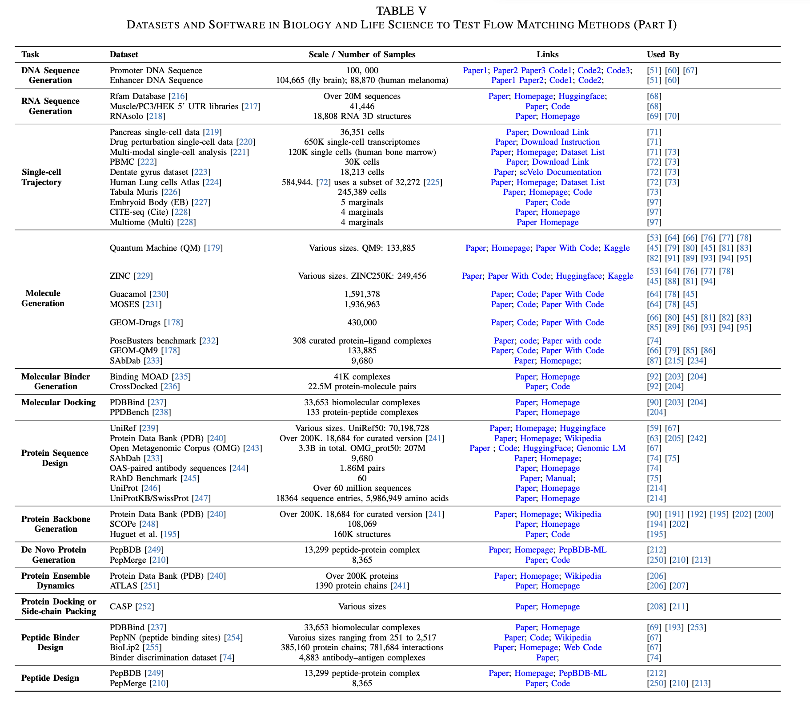
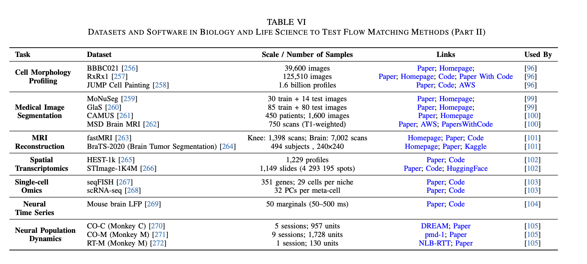

# Awesome-Flow-Matching-Biology [](https://awesome.re)

A curated list of papers and resources based on "Flow Matching Meets Biology and Life Science: A Survey" (arXiv 2025).

**This repo will be continuously updated. Don't forget to star ⭐ it and keep tuned!**

**Please cite the paper in [Citations](#citations) if you find the resource helpful for your research. Thanks!**

<p align="center">
    
</p>

## Why Flow Matching for Biology?

Flow Matching (FM) has recently emerged as a powerful paradigm for generative modeling, offering a flexible and scalable framework applicable across a wide range of biological domains. By constructing continuous probability trajectories between simple and complex distributions, FM provides an efficient and principled method to model high-dimensional, structured biological data while preserving structural and geometric constraints.

## Overview

<p align="center">
    
</p>

## Contents

- [Awesome-Flow-Matching-Biology](#awesome-flow-matching-biology-)
  - [Why Flow Matching for Biology?](#why-flow-matching-for-biology)
  - [Overview](#overview)
  - [Contents](#contents)
  - [Flow Matching Basics](#flow-matching-basics)
    - [General FM](#general-fm)
        - [Conditional FM](#conditional-fm)
        - [Rectified FM](#rectified-fm)
        - [Non-Euclidean FM](#non-euclidean-fm)
    - [Discrete FM](#discrete-fm)
      - [CTMC](#ctmc)
      - [Simplex](#simplex)
  - [Bio Sequence Modeling](#bio-sequence-modeling)
    - [DNA Sequence](#dna-sequence)
    - [RNA Sequence](#rna-sequence)
    - [Whole-Genome](#whole-genome)
    - [Antibody Sequence](#antibody-sequence)
  - [Molecule Generation and Design](#molecule-generation-and-design)
    - [2D Molecule Generation](#2d-molecule-generation)
    - [3D Molecule Generation](#3d-molecule-generation)
      - [SE(3)-equivariant](#se3-equivariant)
      - [Efficiency](#efficiency)
      - [Guided Generation](#guided-generation)
    - [Conditional Molecule Design and Applications](#conditional-molecule-design-and-applications)
  - [Protein Generation](#protein-generation)
    - [Unconditional Generation](#unconditional-generation)
      - [Backbone Generation](#backbone-generation)
      - [Co-design Generation](#co-design-generation)
    - [Conditional Generation](#conditional-generation)
      - [Motif-scaffolding](#motif-scaffolding)
      - [Pocket & Binder Design](#pocket--binder-design)
    - [Structure Prediction](#structure-prediction)
      - [Conformer Prediction](#conformer-prediction)
      - [Side-chain Packing](#side-chain-packing)
      - [Docking Prediction](#docking-prediction)
    - [Peptide and Antibody Generation](#peptide-and-antibody-generation)
  - [Other Biology Applications](#other-biology-applications)
    - [Dynamic Cell Trajectory](#dynamic-cell-trajectory)
    - [Bio-Image Generation](#bio-image-generation)
    - [Spatial Transcriptomics](#spatial-transcriptomics)
    - [Neural Activities](#neural-activities)
  - [Datasets and Software Tools](#datasets-and-software-tools)
  - [Contributing](#contributing)
  - [Citations](#citations)

## Flow Matching Basics

### General FM

#### Conditional FM

1. **Building normalizing flows with stochastic interpolants** `ICLR 2023`

    *Michael S. Albergo, Eric Vanden-Eijnden* [[Paper](https://arxiv.org/abs/2209.15571)]
      [[Code](https://github.com/malbergo/stochastic-interpolants)], 2023
2. **Variational flow matching for graph generation** `NeurIPS 2024`

      *Floor Eijkelboom, Grigory Bartosh, Christian Andersson Naesseth, Max Welling, Jan-Willem van de Meent*
  [[Paper](https://arxiv.org/abs/2406.04843)], 2024
3. **Flow matching for generative modeling** `ICLR 2023`

      *Yaron Lipman, Ricky T. Q. Chen, Heli Ben-Hamu, Maximilian Nickel, Matt Le*
  [[Paper](https://arxiv.org/abs/2210.02747)] [[Code](https://github.com/facebookresearch/flow_matching)], 2023
4. **Improving and generalizing flow-based generative models with minibatch optimal transport** `TMLR`

      *Alexander Tong, Nikolay Malkin, Guillaume Huguet, Yanlei Zhang, Jarrid Rector-Brooks, Kilian Fatras, Guy Wolf,
  Yoshua Bengio* [[Paper](https://arxiv.org/abs/2302.00482)]
  [[Code](https://github.com/atong01/conditional-flow-matching)], 2024

#### Rectified FM


  1. **Optimal flow matching: Learning straight trajectories in just one step** `NeurIPS 2024`

      *Nikita Kornilov, Petr Mokrov, Alexander Gasnikov, Alexander Korotin* [[Paper](https://arxiv.org/abs/2403.13117)] [[Code](https://github.com/Jhomanik/Optimal-Flow-Matching)], 2024

  2. **Improving and generalizing flow-based generative models with minibatch optimal transport** `arXiv`

      *Alexander Tong, Kilian Fatras, Nikolay Malkin, Guillaume Huguet, Yanlei Zhang, Jarrid Rector-Brooks, Guy Wolf,
  Yoshua Bengio* [[Paper](https://arxiv.org/abs/2302.00482)]
  [[Code](https://github.com/atong01/conditional-flow-matching)], 2023

  3. **Improving the training of rectified flows** `NeurIPS 2024`

      *Sangyun Lee, Zinan Lin, Giulia Fanti* [[Paper](https://arxiv.org/abs/2405.20320)] [[Code](https://github.com/sangyun884/rfpp)], 2024

  4. **Flow straight and fast: Learning to generate and transfer data with rectified flow** `ICLR 2023`

      *Xingchao Liu, Chengyue Gong, Qiang Liu* [[Paper](https://openreview.net/forum?id=XVjTT1nw5z)], 2023

#### Non-Euclidean FM

1. **Flow matching on general geometries** ` ICLR 2024`

      *Ricky T. Q. Chen, Yaron Lipman* [[Paper](https://arxiv.org/abs/2302.03660)], 2023


  3. **α-flow: A unified framework for continuous-state discrete flow matching models** `preprint`

      *Cheng Cheng, Jiahao Li, Jianfei Fan, Ge Liu* [[Paper](https://arxiv.org/abs/2504.10283)], 2025

  4. **Fisher flow matching for generative modeling over discrete data** `NeurIPS 2024`

      *Oscar Davis, Samuel Kessler, Mircea Petrache, Ismail Ceylan, Michael Bronstein, Joey Bose* [[Paper](https://arxiv.org/abs/2405.14664)]
  [[Code](https://github.com/olsdavis/fisher-flow)], 2024

  5. **Neural manifold ordinary differential equations** `NeurIPS 2020`

      *Aaron Lou, Derek Lim, Isay Katsman, Leo Huang, Qingxuan Jiang, Ser Nam Lim, Christopher M. De Sa* [[Paper](https://arxiv.org/abs/2006.10254)]
  , 2020

  6. **Riemannian continuous normalizing flows** `NeurIPS 2020`

      *Emile Mathieu, Maximilian Nickel* [[Paper](https://arxiv.org/pdf/2006.10605)], 2020

### Discrete FM

#### CTMC

  1. **Discrete flow matching** `NeurIPS 2024`

      *Itai Gat, Tal Remez, Neta Shaul, Felix Kreuk, Ricky T. Q. Chen, Gabriel Synnaeve, Yossi Adi, Yaron Lipman*
  [[Paper](https://arxiv.org/abs/2407.15595)] [[Code](https://github.com/RobinKa/discrete-flow-matching-pytorch)], 2024

  2. **α-flow: A unified framework for continuous-state discrete flow matching models** `arXiv`

      *Cheng Cheng, Jiahao Li, Jianfei Fan, Ge Liu* [[Paper](https://arxiv.org/abs/2504.10283)] , 2025

  3. **Fisher flow matching for generative modeling over discrete data** `NeurIPS 2024`

      *Oscar Davis, Samuel Kessler, Mircea Petrache, Ismail Ceylan, Michael Bronstein, Joey Bose* [[Paper](https://arxiv.org/abs/2405.14664)]
  [[Code](https://github.com/olsdavis/fisher-flow)], 2024

  4. **Generative flows on discrete state-spaces: Enabling multimodal flows with applications to protein co-design**
  `arXiv`

      *Andrew Campbell, Jason Yim, Regina Barzilay, Tom Rainforth, Tommi Jaakkola*
  [[Paper](https://arxiv.org/abs/2402.04997)], 2024

  5. **Defog: Discrete flow matching for graph generation** `arXiv`

      *Yiming Qin, Manuel Madeira, Dorina Thanou, Pascal Frossard* [[Paper](https://arxiv.org/abs/2410.04263)]
  [[Code](https://github.com/manuelmlmadeira/DeFoG)], 2024

  6. **Flow matching with general discrete paths: A kinetic-optimal perspective** `ICLR 2025`

      *Neta Shaul, Itai Gat, Marton Havasi, Daniel Severo, Anuroop Sriram, Peter Holderrieth, Brian Karrer, Yaron Lipman,
  Ricky T. Q. Chen* [[Paper](https://arxiv.org/abs/2412.03487)], 2024
#### Simplex

  1. **Dirichlet flow matching with applications to DNA sequence design** `arXiv`

      *Hannes Stark, Bowen Jing, Chenyu Wang, Gabriele Corso, Bonnie Berger, Regina Barzilay, Tommi Jaakkola*
  [[Paper](https://arxiv.org/abs/2402.05841)] [[Code](https://github.com/HannesStark/dirichlet-flow-matching.)], 2024

  2. **Mixed continuous and categorical flow matching for 3D de novo molecule generation** `arXiv`

      *Ian Dunn, David Ryan Koes* [[Paper](https://arxiv.org/abs/2404.19739)] [[Code](https://github.com/dunni3/FlowMol)], 2024

  3. **Gumbel-softmax flow matching with straight-through guidance for controllable biological sequence generation**
  `arXiv`

      *Shaorong Tang, Yifan Zhang, Alexander Tong, Pranam Chatterjee* [[Paper](https://arxiv.org/abs/2503.17361)]
      , 2025

## Bio Sequence Modeling

### DNA Sequence

  1. **Fisher flow matching for generative modeling over discrete data** `NeurIPS 2024`

      *Oscar Davis, Samuel Kessler, Mircea Petrache, Ismail Ceylan, Michael Bronstein, Joey Bose* [[Paper](https://arxiv.org/abs/2405.14664)]
  [[Code](https://github.com/olsdavis/fisher-flow)], 2024
   2. **Dirichlet flow matching with applications to DNA sequence design** `arXiv`

      *Hannes Stark, Bowen Jing, Chenyu Wang, Gabriele Corso, Bonnie Berger, Regina Barzilay, Tommi Jaakkola*
  [[Paper](https://arxiv.org/abs/2402.05841)] [[Code](https://github.com/HannesStark/dirichlet-flow-matching)], 2024

  3. **Gumbel-softmax flow matching with straight-through guidance for controllable biological sequence generation**
  `arXiv`

      *Shaorong Tang, Yifan Zhang, Alexander Tong, Pranam Chatterjee* [[Paper](https://arxiv.org/abs/2503.17361)], 2025

### RNA Sequence

1. **RNACG: A universal RNA sequence conditional generation model based on flow-matching** `arXiv`

      *Lei Gao, Zhi John Lu* [[Paper](https://arxiv.org/abs/2407.19838)] , 2024

  2. **RNAFlow: RNA structure & sequence design via inverse folding-based flow matching** `arXiv`

      *Divya Nori, Wengong Jin* [[Paper](https://arxiv.org/abs/2405.18768)] , 2024

  3. **RiboGen: RNA sequence and structure co-generation with equivariant multiflow** `arXiv`

      *Daniel Rubin, Alex de Souza Costa, Manvitha Ponnapati, Joseph Jacobson* [[Paper](https://arxiv.org/abs/2503.02058)]
  , 2025

### Whole-Genome

  1. **GeNOT: Entropic (Gromov) Wasserstein flow matching with applications to single-cell genomics** `NeurIPS 2024`

      *Dominik Klein, Théo Uscidda, Fabian Theis, Marco Cuturi* [[Paper](https://arxiv.org/abs/2310.09254)]
  [[Code](https://github.com/ott-jax/ott)], 2024

  2. **CellFlow: A generative flow-based model for single-cell count data** `ICLR 2024 Workshop`

      *Antonio Palma, Till Richter, Hao Zhang, Andrea Dittadi, Fabian J. Theis*
  [[Paper](https://openreview.net/forum?id=xaLXV2j8vl)] [[Code](https://github.com/theislab/CellFlow)], 2024

  3. **Multi-modal and multi-attribute generation of single cells with CFGen** `ICLR 2025`

      *Antonio Palma, Till Richter, Hao Zhang, Martin Lubetzki, Alexander Tong, Andrea Dittadi, Fabian J. Theis*
  [[Paper](https://arxiv.org/abs/2407.11734)], 2025

### Antibody Sequence

4. **IgFlow: Flow Matching for de novo Antibody Design** `NeurIPS 2024`

   *S. Nagaraj, A. Shanehsazzadeh, H. Park, J. King, S. Levine* [[Paper](https://www.mlsb.io/papers_2024/IgFlow%3A_Flow_Matching_for_De_Novo_Antibody_Design.pdf)] , 2024

5. **DyAB: Flow Matching for Flexible Antibody Design with AlphaFold-driven Pre-binding Antigen** `AAAI 2025`

   *C. Tan, Y. Zhang, Z. Gao, Y. Huang, H. Lin, L. Wu, F. Wu, M. Blanchette, S. Z. Li* [[Paper](https://arxiv.org/abs/2503.01910)] [[Code](https://github.com/A4Bio/dyAb)], 2025


## Molecule Generation and Design

### 2D Molecule Generation

6. **Improving Molecular Graph Generation with Flow Matching and Optimal Transport** `arXiv 2024`

   *X. Hou, T. Zhu, M. Ren, D. Bu, X. Gao, C. Zhang, S. Sun* [[Paper](https://doi.org/10.48550/arXiv.2411.05676)], 2024

7. **Variational Flow Matching for Graph Generation** `NeurIPS 2024`

   *F. Eijkelboom, G. Bartosh, C. A. Naesseth, M. Welling, J. van de Meent* [[Paper](http://papers.nips.cc/paper_files/paper/2024/hash/15b780350b302a1bf9a3bd273f5c15a4-Abstract-Conference.html)], 2024

8. **DeFoG: Discrete Flow Matching for Graph Generation** `arXiv 2024`

   *Y. Qin, M. Madeira, D. Thanou, P. Frossard* [[Paper](https://doi.org/10.48550/arXiv.2410.04263)] [[Code](https://github.com/manuelmlmadeira/DeFoG)], 2024


### 3D Molecule Generation

#### SE(3)-equivariant

9. **EquiFlow: Equivariant Conditional Flow Matching with Optimal Transport for 3D Molecular Conformation Prediction** `arXiv 2024`

   *Q. Tian, Y. Xu, Y. Yang, Z. Wang, Z. Liu, P. Yan, X. Li* [[Paper](https://doi.org/10.48550/arXiv.2412.11082)], 2024

10. **Applications of Modular Co-Design for de novo 3D Molecule Generation** `NeurIPS 2024 Workshop`

    *D. Reidenbach, F. Nikitin, O. Isayev, S. G. Paliwal* [[Paper](https://arxiv.org/abs/2505.18392)], 2024

11. **Controlled Generation with Equivariant Variational Flow Matching** `ICML 2025`

    *F. Eijkelboom, H. Zimmermann, S. Vadgama, E. Bekkers, M. Welling, C. A. Naesseth, J.-W. van de Meent* [[Paper](https://arxiv.org/abs/2506.18340)], 2025

12. **ET-Flow: Equivariant Transformer Flow for Molecular Conformer Generation** `arXiv 2024`

    *M. Hassan, N. Shenoy, J. Lee, H. Stark, S. Thaler, D. Beaini* [[Paper](https://arxiv.org/abs/2410.22388)] [[Code](https://github.com/shenoynikhil/ETFlow)], 2024


#### Efficiency

1. **Accelerating 3D Molecule Generation via Jointly Geometric Optimal Transport (GOAT)** `ICLR 2025`

    *H. Hong, W. Lin, K. C. Tan* [[Paper](https://openreview.net/forum?id=VGURexnlUL)] [[Code](https://github.com/WanyuGroup/ICLR2025-GOAT)], 2025

2. **SemlaFlow—Efficient 3D Molecular Generation with Latent Attention and Equivariant Flow Matching** `AISTATS 2025`

    *R. Irwin, A. Tibo, J. P. Janet, S. Olsson* [[Paper](https://raw.githubusercontent.com/mlresearch/v258/main/assets/irwin25a/irwin25a.pdf)] [[Code](https://github.com/rssrwn/semla-flow)], 2025

3. **Efficient Molecular Conformer Generation with SO(3)-Averaged Flow Matching and Reflow** `ICML 2025`

    *Z. Cao, M. Geiger, A. D. S. Costa, D. Reidenbach, K. Kreis, T. Geffner, F. Pellegrini, G. Zhou, E. Kucukbenli* [[Paper](https://arxiv.org/abs/2507.09785)], 2025

4. **ET-Flow: Equivariant Flow-Matching for Molecular Conformer Generation** `NeurIPS 2024`

    *M. Hassan, N. Shenoy, J. Lee, H. Stärk, S. Thaler, D. Beaini* [[Paper](https://arxiv.org/abs/2410.22388)] [[Code](https://github.com/shenoynikhil/ETFlow)], 2024

#### Guided Generation

1. **3D Structure Prediction of Atomic Systems with Flow-based Direct Preference Optimization** `NeurIPS 2024`

    *R. Jiao, X. Kong, W. Huang, Y. Liu* [[Paper](https://proceedings.neurips.cc/paper_files/paper/2024/file/c6fdc94aeb2cb3a426d510d970045dab-Paper-Conference.pdf)], 2024

2. **Extended Flow Matching: A Method of Conditional Generation with Generalized Continuity Equation** `arXiv 2024`

    *N. Isobe, M. Koyama, K. Hayashi, K. Fukumizu* [[Paper](https://doi.org/10.48550/arXiv.2402.18839)], 2024

3. **Mixed Continuous and Categorical Flow Matching for 3D De Novo Molecule Generation** `arXiv 2024`

    *I. Dunn, D. R. Koes* [[Paper](https://doi.org/10.48550/arXiv.2404.19739)] [[Code](https://github.com/Dunni3/FlowMol)], 2024

4. **Energy-Based Flow Matching for Generating 3D Molecular Structure** `ICML 2025`

    *W. Zhou, C. I. Sprague, V. Viliuga, M. Tadiello, A. Elofsson, H. Azizpour* [[Paper](https://arxiv.org/abs/2508.18949)] [[Code](https://github.com/CaviarLover/IDFlow)], 2025

5. **Training-Free Guided Flow Matching with Optimal Control** `arXiv 2024`

    *L. Wang, C. Cheng, Y. Liao, Y. Qu, G. Liu* [[Paper](https://doi.org/10.48550/arXiv.2410.18070)] [[Code](https://github.com/WangLuran/Guided-Flow-Matching-with-Optimal-Control)], 2024

### Conditional Molecule Design and Applications
1. **FlexSBDD: Structure-Based Drug Design with Flexible Protein Modeling** `NeurIPS 2024`

    *Z. Zhang, M. Wang, Q. Liu* [[Paper](https://arxiv.org/abs/2409.19645)] [[Code](https://github.com/zaixizhang/FlexSBDD)], 2024

2. **Geometric Representation Condition Improves Equivariant Molecule Generation** `arXiv 2024`

    *Z. Li, C. Zhou, X. Wang, X. Peng, M. Zhang* [[Paper](https://doi.org/10.48550/arXiv.2410.03655)] [[Code](https://github.com/GraphPKU/GeoRCG)], 2024

3. **Improving Structural Plausibility in 3D Molecule Generation via Property-Conditioned Training with Distorted Molecules** `bioRxiv 2024`

    *L. Vost, V. Chenthamarakshan, P. Das, C. M. Deane* [[Paper](https://www.biorxiv.org/content/10.1101/2024.09.17.613136v1)], 2024

4. **Stiefel Flow Matching for Moment-Constrained Structure Elucidation** `arXiv 2024`

    *A. H. Cheng, A. Lo, K. L. K. Lee, S. Miret, A. Aspuru-Guzik* [[Paper](https://doi.org/10.48550/arXiv.2412.12540)] [[Code](https://github.com/aspuru-guzik-group/stiefelFM)], 2024


## Protein Generation

### Unconditional Generation

#### Backbone Generation

1. **Fast Protein Backbone Generation with SE(3) Flow Matching** `arXiv 2023`

    *J. Yim, A. Campbell, A. Y. Foong, M. Gastegger, J. Jiménez-Luna, S. Lewis, V. G. Satorras, B. S. Veeling, R. Barzilay, T. Jaakkola, F. Noé* [[Paper](https://arxiv.org/abs/2310.05297)] [[Code](https://github.com/microsoft/protein-frame-flow)], 2023

2. **SE(3)-Stochastic Flow Matching for Protein Backbone Generation** `arXiv 2023`

    *A. J. Bose, T. Akhound-Sadegh, G. Huguet, K. Fatras, J. Rector-Brooks, C.-H. Liu, A. C. Nica, M. Korablyov, M. Bronstein, A. Tong* [[Paper](https://arxiv.org/abs/2310.02391)] [[Code](https://github.com/DreamFold/FoldFlow)], 2023

3. **Robust and Reliable de novo Protein Design: A Flow-Matching-Based Protein Generative Model Achieves Remarkably High Success Rates** `bioRxiv 2025`

    *J. Yan, Z. Cui, W. Yan, Y. Chen, M. Pu, S. Li, S. Ye* [[Paper](https://www.biorxiv.org/content/10.1101/2025.04.29.651154v1)], 2025

4. **Generating Highly Designable Proteins with Geometric Algebra Flow Matching** `NeurIPS 2024`

    *S. Wagner, L. Seute, V. Viliuga, N. Wolf, F. Gräter, J. Stühmer* [[Paper](https://arxiv.org/abs/2411.05238)] [[Code](https://github.com/hits-mli/gafl)], 2024

5. **Sequence-Augmented SE(3)-Flow Matching for Conditional Protein Backbone Generation** `NeurIPS 2024`

    *G. Huguet, J. Vuckovic, K. Fatras, E. Thibodeau-Laufer, P. Lemos, R. Islam, C.-H. Liu, J. Rector-Brooks, T. Akhound-Sadegh, M. Bronstein, A. Tong, A. J. Bose* [[Paper](https://arxiv.org/abs/2405.20313)] [[Code](https://github.com/DreamFold/FoldFlow)], 2024

6. **Proteina: Scaling Flow-Based Protein Structure Generative Models** `arXiv 2025`

    *T. Geffner, K. Didi, Z. Zhang, D. Reidenbach, Z. Cao, J. Yim, M. Geiger, C. Dallago, E. Kucukbenli, A. Vahdat, et al.* [[Paper](https://arxiv.org/abs/2503.00710)] [[Code](https://github.com/NVIDIA-Digital-Bio/proteina)], 2025

7. **ProtComposer: Compositional Protein Structure Generation with 3D Ellipsoids** `ICLR 2025`

    *H. Stark, B. Jing, T. Geffner, J. Yim, T. Jaakkola, A. Vahdat, K. Kreis* [[Paper](https://arxiv.org/abs/2503.05025)] [[Code](https://github.com/NVlabs/protcomposer)], 2025


#### Co-design Generation

1. **Co-Design Protein Sequence and Structure in Discrete Space via Generative Flow (CoFlow)** `Bioinformatics 2025`

    *S. Yang, L. Ju, P. Cheng, J. Zhou, Y. Cai, D. Feng* [[Paper](https://academic.oup.com/bioinformatics/article/41/5/btaf248/8123382)] [[Code](https://github.com/LtECoD/CoFlow)], 2025

2. **An All-Atom Generative Model for Designing Protein Complexes (APM)** `ICML 2025`

    *R. Chen, D. Xue, X. Zhou, Z. Zheng, X. Zeng, Q. Gu* [[Paper](https://arxiv.org/abs/2504.13075)] [[Code](https://github.com/bytedance/apm)], 2025

3. **Generative Flows on Discrete State-Spaces: Enabling Multimodal Flows with Applications to Protein Co-Design (Multiflow)** `ICML 2024`

    *A. Campbell, J. Yim, R. Barzilay, T. Rainforth, T. Jaakkola* [[Paper](https://proceedings.mlr.press/v235/campbell24a.html)] [[Code](https://github.com/jasonkyuyim/multiflow)], 2024

### Conditional Generation

#### Motif-scaffolding

1.  **Improved Motif-Scaffolding with SE(3) Flow Matching** `arXiv 2024`

    *Jason Yim, Andrew Campbell, Emile Mathieu, Andrew Y. K. Foong, Michael Gastegger, José Jiménez-Luna, Sarah Lewis, Victor Garcia Satorras, Bastiaan S. Veeling, Frank Noé, Regina Barzilay, Tommi S. Jaakkola* [[Paper](https://arxiv.org/abs/2401.04082)] [[Code](https://github.com/microsoft/protein-frame-flow)], 2024

2.   **EVA: Geometric Inverse Design for Fast Protein Motif-Scaffolding with Coupled Flow** `ICLR 2025`
    *Yufei Huang, Yunshu Liu, Lirong Wu, Haitao Lin, Cheng Tan, Odin Zhang, Zhangyang Gao, Siyuan Li, Zicheng Liu, Yunfan Liu, Tailin Wu, Stan Z. Li* [[Paper](https://openreview.net/forum?id=KHkBpvmYVI)], 2025


#### Pocket & Binder Design

1. **Design of Ligand-Binding Proteins with Atomic Flow Matching** `arXiv 2024`

   *Junqi Liu, Shaoning Li, Chence Shi, Zhi Yang, Jian Tang* [[Paper](https://arxiv.org/abs/2409.12080)], 2024

2. **Harmonic Self-Conditioned Flow Matching for Joint Multi-Ligand Docking and Binding Site Design** `ICML 2024`

   *Hannes Stärk, Bowen Jing, Regina Barzilay, Tommi Jaakkola* [[Paper](https://proceedings.mlr.press/v235/stark24a.html)] [[Code](https://github.com/HannesStark/FlowSite)], 2024

3. **Generalized Protein Pocket Generation with Prior-Informed Flow Matching (PocketFlow)** `NeurIPS 2024`

   *Zaixi Zhang, Marinka Zitnik, Qi Liu* [[Paper](https://proceedings.neurips.cc/paper_files/paper/2024/file/43eeff8a47075418c3e2b8b204053448-Paper-Conference.pdf)] [[Code](https://github.com/zaixizhang/PocketFlow)], 2024

4. **FlowBack: A Generalized Flow-Matching Approach for Biomolecular Backmapping** `JCIM 2025`

   *Michael S. Jones, Smayan Khanna, Andrew L. Ferguson* [[Paper](https://doi.org/10.1021/acs.jcim.4c02046)] [[Code](https://github.com/mrjoness/Flow-Back)], 2025

### Structure Prediction

#### Conformer Prediction

1. **AlphaFold Meets Flow Matching for Generating Protein Ensembles** `arXiv 2024`

   *B. Jing, B. Berger, T. Jaakkola* [[Paper](https://arxiv.org/abs/2402.04845)] [[Code](https://github.com/bjing2016/alphaflow)], 2024

2. **P2DFlow: A Protein Ensemble Generative Model with SE(3) Flow Matching** `JCTC 2025`

   *Y. Jin, Q. Huang, Z. Song, M. Zheng, D. Teng, Q. Shi* [[Paper](https://pubs.acs.org/doi/10.1021/acs.jctc.4c01620)] [[Code](https://github.com/BLEACH366/P2DFlow)], 2025

3. **FlowPacker: Protein Side-Chain Packing with Torsional Flow Matching** `Bioinformatics 2025`

   *J. S. Lee, P. M. Kim* [[Paper](https://academic.oup.com/bioinformatics/article/41/3/btaf010/7950662)] [[Code](https://gitlab.com/mjslee0921/flowpacker)], 2025

4. **EquiformerV2: Improved Equivariant Transformer for Scaling to Higher-Degree Representations** `arXiv 2023`

   *Y.-L. Liao, B. Wood, A. Das, T. Smidt* [[Paper](https://arxiv.org/abs/2306.12059)] [[Code](https://github.com/atomicarchitects/equiformer_v2)], 2023

5. **Full-Atom Peptide Design based on Multi-modal Flow Matching** `ICML 2024`

   *J. Li, C. Cheng, Z. Wu, R. Guo, S. Luo, Z. Ren, J. Peng, J. Ma* [[Paper](https://proceedings.mlr.press/v235/li24o.html)] [[Code](https://github.com/Ced3-han/PepFlowww)], 2024


#### Side-chain Packing

1. **FlowPacker: Protein Side-Chain Packing with Torsional Flow Matching** `Bioinformatics 2025`

   *J. S. Lee, P. M. Kim* [[Paper](https://academic.oup.com/bioinformatics/article/41/3/btaf010/7950662)] [[Code](https://gitlab.com/mjslee0921/flowpacker)], 2025

2. **EquiformerV2: Improved Equivariant Transformer for Scaling to Higher-Degree Representations** `arXiv 2023`

   *Y.-L. Liao, B. Wood, A. Das, T. Smidt* [[Paper](https://arxiv.org/abs/2306.12059)] [[Code](https://github.com/atomicarchitects/equiformer_v2)], 2023

3. **Full-Atom Peptide Design based on Multi-modal Flow Matching** `ICML 2024`

   *J. Li, C. Cheng, Z. Wu, R. Guo, S. Luo, Z. Ren, J. Peng, J. Ma* [[Paper](https://proceedings.mlr.press/v235/li24o.html)] [[Code](https://github.com/Ced3-han/PepFlowww)], 2024

#### Docking Prediction

1. **Harmonic Self-Conditioned Flow Matching for Joint Multi-Ligand Docking and Binding Site Design** `ICML 2024`

   *Hannes Stärk, Bowen Jing, Regina Barzilay, Tommi Jaakkola* [[Paper](https://proceedings.mlr.press/v235/stark24a.html)] [[Code](https://github.com/HannesStark/FlowSite)], 2024

2. **FlowDock: Geometric Flow Matching for Generative Protein-Ligand Docking and Affinity Prediction** `Bioinformatics 2025`

   *Alex Morehead, Jianlin Cheng* [[Paper](https://academic.oup.com/bioinformatics/article/41/Supplement_1/i198/8199366)] [[Code](https://github.com/BioinfoMachineLearning/FlowDock)], 2025

### Peptide and Antibody Generation

1. **P2DFlow: A Protein Ensemble Generative Model with SE(3) Flow Matching** `JCTC 2025`

   *Y. Jin, Q. Huang, Z. Song, M. Zheng, D. Teng, Q. Shi* [[Paper](https://pubs.acs.org/doi/10.1021/acs.jctc.4c01620)] [[Code](https://github.com/BLEACH366/P2DFlow)], 2025

2. **Full-Atom Peptide Design based on Multi-modal Flow Matching** `ICML 2024`

   *J. Li, C. Cheng, Z. Wu, R. Guo, S. Luo, Z. Ren, J. Peng, J. Ma* [[Paper](https://proceedings.mlr.press/v235/li24o.html)] [[Code](https://github.com/Ced3-han/PepFlowww)], 2024

3. **PPFlow: Target-Aware Peptide Design with Torsional Flow Matching** `bioRxiv 2024`

   *H. Lin, O. Zhang, H. Zhao, D. Jiang, L. Wu, Z. Liu, Y. Huang, S. Z. Li* [[Paper](https://www.biorxiv.org/content/10.1101/2024.03.07.583831v1)] [[Code](https://github.com/edapinenut/ppflow)], 2024

4. **Non-Linear Flow Matching for Full-Atom Peptide Design** `arXiv 2025`

   *D. Huang, S. Tu* [[Paper](https://arxiv.org/abs/2502.15855)], 2025

5. **ProtFlow: Fast Protein Sequence Design via Flow Matching on Compressed Protein Language Model Embeddings** `arXiv 2025`

   *Z. Kong, Y. Zhu, Y. Xu, H. Zhou, M. Yin, J. Wu, H. Xu, C.-Y. Hsieh, T. Hou, J. Wu* [[Paper](https://arxiv.org/abs/2504.10983)], 2025

## Other Biology Applications

### Dynamic Cell Trajectory

1. **GeNOT: Entropic (Gromov) Wasserstein Flow Matching with Applications to Single-Cell Genomics** `NeurIPS 2024`

   *Dominik Klein, Théo Uscidda, Fabian Theis, Marco Cuturi* [[Paper](https://proceedings.neurips.cc/paper_files/paper/2024/file/bc46e29f91e676747c584ca181cb0ea1-Paper-Conference.pdf)] [[Code](https://github.com/MUCDK/genot)], 2024

2. **CellFlow: Simulating Cellular Morphology Changes via Flow Matching** `arXiv 2025`

   *Yuhui Zhang, Yuchang Su, Chenyu Wang, Tianhong Li, Zoe Wefers, Jeffrey Nirschl, James Burgess, Daisy Ding, Alejandro Lozano, Emma Lundberg, Serena Yeung-Levy* [[Paper](https://arxiv.org/abs/2502.09775)], 2025

3. **Metric Flow Matching for Smooth Interpolations on the Data Manifold** `NeurIPS 2024`

   *Kacper Kapuśniak, Peter Potaptchik, Teodora Reu, Leo Zhang, Alexander Tong, Michael Bronstein, Avishek Joey Bose, Francesco Di Giovanni* [[Paper](https://proceedings.neurips.cc/paper_files/paper/2024/file/f381114cf5aba4e45552869863deaaa7-Paper-Conference.pdf)] [[Code](https://github.com/kksniak/metric-flow-matching)], 2024

4. **Diversified Flow Matching with Translation Identifiability** `ICML 2025`

   *Sagar Shrestha, Xiao Fu* [[Paper](https://openreview.net/pdf?id=P0zvNhHGG9)], 2025


### Bio-Image Generation

1. **FlowSDF: Flow Matching for Medical Image Segmentation Using Distance Transforms** `arXiv 2024`

   *Lea Bogensperger, Dominik Narnhofer, Alexander Falk, Konrad Schindler, Thomas Pock* [[Paper](https://arxiv.org/abs/2405.18087)] [[Code](https://github.com/leabogensperger/FlowSDF)], 2024

2. **Flow Matching for Medical Image Synthesis: Bridging the Gap Between Speed and Quality** `arXiv 2025`

   *Milad Yazdani, Yasamin Medghalchi, Pooria Ashrafian, Ilker Hacihaliloglu, Dena Shahriari* [[Paper](https://arxiv.org/abs/2503.00266)], 2025

3. **Multimodal Straight Flow Matching for Accelerated MR Imaging** `Computers in Biology and Medicine 2024`

   *Daikun Zhang, Qiuyi Han, Yuzhu Xiong, Hongwei Du* [[Paper](https://doi.org/10.1016/j.compbiomed.2024.108668)], 2024


### Spatial Transcriptomics

1. **Wasserstein Flow Matching: Generative Modeling over Families of Distributions** `arXiv 2024`

   *Doron Haviv, Aram-Alexandre Pooladian, Dana Pe’er, Brandon Amos* [[Paper](https://arxiv.org/abs/2411.00698)] [[Code](https://github.com/DoronHav/WassersteinFlowMatching)], 2024

2. **Scalable Generation of Spatial Transcriptomics from Histology Images via Whole-Slide Flow Matching** `arXiv 2025`

   *Tinglin Huang, Tianyu Liu, Mehrtash Babadi, Wengong Jin, Rex Ying* [[Paper](https://arxiv.org/abs/2506.05361)] [[Code](https://github.com/Graph-and-Geometric-Learning/STFlow)], 2025


### Neural Activities

1. **Stream-level Flow Matching with Gaussian Processes** `ICML 2025`

   *Ganchao Wei, Li Ma* [[Paper](https://openreview.net/forum?id=qg9p1I5lmp)] [[Code](https://github.com/weigcdsb/GP-CFM)], 2025

2. **Flow Matching for Few-Trial Neural Adaptation with Stable Latent Dynamics** `ICML 2025`

   *Puli Wang, Yu Qi, Yueming Wang, Gang Pan* [[Paper](https://openreview.net/forum?id=nKJEAQ6JCY)], 2025


## Datasets and Software Tools
Table 5 and 6 in our survey paper [Flow Matching Meets Biology and Life Science: A Survey](https://arxiv.org/abs/2507.17731).

<p align="center">
    
</p>
<p align="center">
    
</p>

## Contributing

Contributions to this repository are welcome!

If you find any error or have relevant resources, feel free to open an issue or a pull request.


## Citations

Please cite the following paper if you find the resource helpful for your research:

```bibtex
@article{li2025flow,
  title={Flow Matching Meets Biology and Life Science: A Survey},
  author={Li, Zihao and Zeng, Zhichen and Lin, Xiao and Fang, Feihao and Qu, Yanru and Xu, Zhe and Liu, Zhining and Ning, Xuying and Wei, Tianxin and Liu, Ge and Tong, Hanghang and He, Jingrui},
  journal={arXiv preprint arXiv:2507.17731},
  year={2025}
}
```


## License

This project is licensed under the MIT License - see the [LICENSE](LICENSE) file for details.

---
